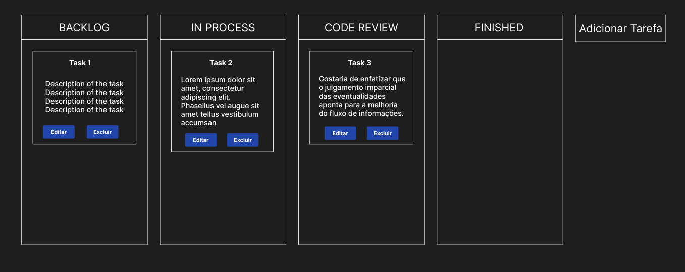

# Elaboração da Proposta e Análise: Modelagem e Protótipos

## 1. Introdução

A proposta é desenvolver uma aplicação web para organizar tarefas em um formato de quadro Kanban, composto por quatro colunas principais: Backlog, Em Processo, Revisão de Código e Concluído. O objetivo é proporcionar uma interface intuitiva e eficiente para gerenciar o fluxo de trabalho de projetos.

## 2. Objetivos

- Desenvolver uma aplicação web de fácil utilização.
- Permitir o cadastro e a organização de tarefas em quatro colunas distintas.
- Facilitar a visualização do progresso das tarefas em cada etapa do processo.

## 3. Funcionalidades Principais

- Cadastro de novas tarefas.
- Edição e exclusão de tarefas.

## 4. Tecnologias Utilizadas

- Frontend: ReactJS
- Backend: Node.js, Express.js, Postgres.

## 5. Fluxo de Funcionamento

1. O usuário acessa a aplicação por meio de um navegador web.
2. Na página inicial, será apresentado o quadro Kanban com as quatro colunas.
3. O usuário poderá clicar em "Adicionar Tarefa" para inserir uma nova tarefa.
4. Ao criar uma nova tarefa, o usuário poderá fornecer informações, como título e descrição.
5. As tarefas serão exibidas como cartões dentro de suas respectivas colunas.
6. Cada tarefa possui um botão de editar e excluir.
7. As alterações serão salvas no banco de dados.

## 6. Protótipo

O protótipo mostra a tela principal com os botões que dão acesso às funcionalidades principais do sistema.

## Conclusão

A proposta de desenvolvimento de uma aplicação web para organização de tarefas em um quadro Kanban apresenta-se como uma solução eficaz para otimizar o fluxo de trabalho de projetos. Com a utilização de tecnologias modernas espera-se oferecer uma ferramenta fácil e intuitiva para gerenciamento de tarefas.

